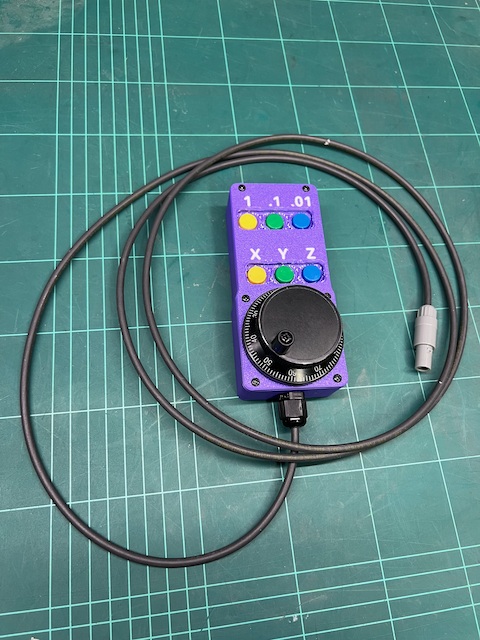

# PicoPendant

## Description

Inspired by the [CNC-Pendant-Firmware](https://github.com/Duet3D/CNC-Pendant-Firmware), I created a simple CNC pendant based on the cheap Raspberry Pico microcontroller to be used with Duet3D Ltd RepRapFirmware. 

It is compatible with all versions of the Pico microcontroller RP2040 and RP2350. Obviously also compatible with the boards, that is Pico 1, Pico 2, Pico W and Pico 2W.

This is the *only* the software side and some wiring instructions. We'll see if I can make a PCB for it in the future. For now you could try to reproduce [My BOM of the weekend ;)](https://github.com/kohlerj/PicoPendant?tab=readme-ov-file#one-night-project) which ended up in the pendant you see below.



## Features

- Axis selection XYZ
- Multiplier selection: 1X - 1mm, 10X - 0.1mm and 100X - 0.01mm
- Homing by holding Y for 2sec
- Reset by holding X and Z for 2sec

## An "open" BOM

A board (protoboard, PCB or some Frankenstein solution) with the following components:
- 1x Raspberry Pico (or compatible)
- 6x buttons with a normally open contact
- 6x LEDs with adequate resistors
- 1x Schottky diode (1N5819 or similar) - I'd say above 500mA to be safe, Vf as low as possible
- 2x logic level shifters to shift the encoder 5V A/B signals to 3.3V. I used LTV-817 optocouplers because it's what I had on hand. I guess a simple voltage divider would work if anything.

Aside from that you'll need:
- 1x 5V rotary encoder see here: 
- A case, 3D printed most probably
- wires, cables, connectors and some screws

The Pico has a built-in Schmitt trigger action, enough for our purpose. No need to filter the inputs.

## Installation

1. Connect your pendant to a **3.3V compatible UART port** on your mainboard
    - You might need to define a new serial port in your `board.txt` file, e.g. by adding  `serial.aux2.rxTxPins={E.7, E.8}` to `board.txt`.
2. Add the following to your `config.g` file: 

```
M575 P1 S4 B57600 
```

  - P1 is the serial port number. Look at your board.txt for "aux" if you need another UART interface than the TFT or PanelDue dedicated one
  - S4 is required as we are using CRC to check for data integrity
  - B57600 is as configured in the precompiled version. You might need to adapt if you modify the code


3. That's it!

## One night project

I did not want to wait for a PCB so I went ahead a built a prototype on a protoboard together with a 3D printed case.

### BOM

 I used the following components:

- 1x protoboard 50x70mm
- 1x Pico 2 board
- 6x buttons
- 6x LEDs with 100Ohm for the blue and 220Ohm resistors for the green LEDs
- 1x Schottky diode (1N5819)
- 2x LTV-817 DIP-4 optocouplers with 2x 1k resistors for the photodiode side
- 1x 5V rotary encoder, see above
- 1x PG-7 gland
- 1x 3-pin fake *ODU*-like connector
- 4x 2x8mm self-tapping screws
- 6x 3x8mm self-tapping screws
- wires, cables, connectors

### Pins

The pre-compiled version uses the pinout found in the table below.

| Pin | Function | Comment |
|-----|----------|---------|
| GP0  | UART_TX | **3.3V**    |
| GP4  | X axis LED | |
| GP5  | X axis button | internally pulled-up |
| GP10 | encoder A | **3.3V** |
| GP11 | encoder B | **3.3V** |
| GP12 | Y axis LED | |
| GP13 | Y axis button | internally pulled-up |
| GP14 | 1X LED | |
| GP15 | 1X button | internally pulled-up |
| GP16 | 10X LED | |
| GP17 | 10X button | internally pulled-up |
| GP18 | 100X LED | |
| GP19 | 100X button | internally pulled-up |
| GP20 | Z axis LED | |
| GP21 | Z axis button | internally pulled-up |
| VSYS | - | Connected to diode's **cathode** |

Refer to the [configuration section](https://github.com/kohlerj/PicoPendant/blob/main/PicoPendant.cpp#L44-L74) in `PicoPendant.cpp`.

### Wiring and schematics


Link to [schematics](./docs/schematics.png)

### Case

In the CAD folder, you'll find a STEP model of the case. The model includes built-in support and it is meant to be printed with a **layer height of .2mm**. It is a **multicolor** print. The letters need be printed in a translucent material while the case in an opaque one. 

If you do not have a multicolor printer, do the following:
1. Load the model with ALL subparts
2. Remove casing parts and built-in support. Keep only the letters
3. Export this job
4. Add the casing parts and built-in support back and remove the letters
5. Export this job
6. Combine the two jobs
    1. Open the first job and scroll until the end of print code is called. Remove the call and everything below
    2. Add a pause that will allow you to change the filament and come back at exactly the same spot
    3. Copy in the content of the second job
    4. Remove everything up to and including the print start code. 
    5. Tweak the code so that after the pause, the printer will move to the start position of the second job
    6. **Make sure nothing is overlapping**, the skirt in particular if you are using one!!!

The dimensions are **NOT** compensated for ABS, my material of choice. This means that it should print just fine on filament that shrinks less. For ABS, use your material shrinkage parameter or scale up the XY axes by 1%.

Support should come off easily with a flat screwdriver.

You might need to clear up the button holes a little bit. I made them already larger than my prototype but it is untested.

## License

This project is licensed under the MIT License - see the [LICENSE](LICENSE.txt) file for details.

In contains code from the Pico examples repository under BSD-3 license. See the [LICENSE](LICENSE.txt) file for details.
